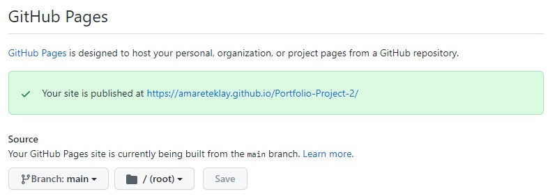

# Rock Paper Scissors Lizard Spock Game

Rock Paper Scissors Lizard Spock is an extension of the traditional [Rock Paper Scissors](https://en.wikipedia.org/wiki/Rock_paper_scissors) game, where two players simultaneously form a rock, paper or scissors with their hands. They make the choice simultaneously so that none of the players gets any information about the other player's strategy. The problem with the Rock Paper Scissors game is that each player has only a small number of (i.e., three) possible strategies and the players end up in a tie more often. 

In Rock Paper Scissors Lizard Spock game, each player has five different possible strategies to choose from, and the likelihood that two players end up in a tie in a given round is lower. 
In other words, the winner can easily be determined and players can resolve their issue more quickly. They save time.

In this application, a user plays against the computer. Computer here refers to a device such as computer, tablet or a mobile phone connected to the internet.
#

# 
 
The game has been deployed (more on deployment procedure later) to github pages. [Play online here.](https://amareteklay.github.io/Portfolio-Project-2/index.html) 

## Table of Contents
- [Purpose](#goals)
  - [User goals](#user-goals)
  - [Owner goals](#owner-goals)
- [Design](#design)
  - [User stories](#user-stories)
  - [User experience](#ux)
    - [Wire frames](#wire-frames)
    - [Color schemes](#color-schemes)
  - [Logic](#logic)
- [Technologies used](#tachnologies-used)
- [Features](#features)
  - [Testing user stories](#testing-user-stories)
  - [Testing Learning Outcomes](#testing-learning-outcomes)
  - [Testing functionality](#testing-functionality)
- [Deployment](#deployment)
- [Credit](#credit)
  - [Code](#code)
  - [Media](#media)
  - [Content](#content)
- [Acknowledgements](#acknowledgements)

# Purpose
The owner and the user of an application have different goals in mind. The former needs to consider the goals of the latter to develop an application that is relevant and has the key features the user would like to see. 
## User goals
- The primary goal of the users of the Rock Paper Scissors Lizard Spock is to find an online game where they can play with the computer and experience a fair amount of challenge and unpredictability.  
## Owner goals
- The goal of the owner of this application is to provide users with a game that has elements of randomness so that they can play and expect to see different outcomes. It also gives users a chance to settle their ambivalence in case of indecision on a dichotomous choice situation. 

# 
[Back to top](#table-of-contents)
# 
# Design
The design of this game is based on the principles of design and the considerations of user stories. The principles adhered to include:
- user experience: the user stories outlined below were used to guide the design and development of this application.
- accessibility: the features of the application were chosen to make the resources accessible to the user. 
- responsivity: users with different devices were taken into account when designing the features of this application.  
## User stories
- As a user, I would like to be able to play with the computer.
- As a user, I want to be able to play the game on my phone or tablet.
- As a user, I want to read the rules of the game at any stage of the game.
- As a user, I want to track my scores.
- As a user, I want to restart the game if I am unhappy about how it is going.
- As a user, I want to read the story behind this game.
- As a user, I want to enter my name and see my name as player on the screen.
- As a user, I want to see what the computer chose in each round.
- As a user, I want to be reminded of the rule for the particular combination in a given round.
- As a user, I want to play for as many times as I feel like playing.
## UX
I followed a User Centered Design (UCD) to make sure that the application is *useful and useable* to meet the foregoing user stories.
### Strategy
- The content of this application is appropriate and relevant, as it is a simple but popular game in many cultures around the world. In my culture, for example, we have variants of this game and creating a digital version of this game makes it easy for people from different cultures to play intuitively. 
### Scope
- The features included in this application are necessary to make the game meet the requirements of the players. It should enable two players to play. It provides them with five strategies to choose from. It evaluates the choices and determines the outcome as well as whether one wins. The players, their strategies and some form of record of previous moves are essential elements of the game. These are also at the center of the user stories.
### Structure
- The structure of the application is organized based on importance from the user's point of view. A player will want to start playing directly or read the rules first. These options should come on the landing page. Each round of the game should also be followed by appropriate feedback, so a results screen should come after a game screen. 
### Skeleton
- Except for the optional name input received from the user, the rest of the interactions are captured in the form of clicks on identifiable places such as buttons or choices of strategies. This will minimize errors from user inputs while running the functionality in the previous plane smoothly.     
### Surface
- This application is a single page application where only the contents of the game screen change dynamically as the input from user actions triggers events and event handlers. This gives the user the comfort of being on a single, stable and familiar environment while being presented with the effects of their choices and actions. This can be viewed as form of *sophistication in simplicity*.
### Wire frames
- [Welcome screen](/assets/images/wireframes/home_page.jpg)

- [Game screen](/assets/images/wireframes/game_screen.jpg)

- [Results screen](/assets/images/wireframes/results_screen.jpg)

- [Rules screen](/assets/images/wireframes/rules_page.jpg)

- [Story page](/assets/images/wireframes/story_page.jpg)
### Color Scheme
I have used colors that are associated with [calmness, serenity and positive feelings](https://www.verywellmind.com/the-color-psychology-of-blue-2795815#:~:text=Blue%20calls%20to%20mind%20feelings,their%20advertising%20and%20marketing%20efforts.). 
- The background color for the game screen is blue, which produces a nice contrast with white font as well as lightsalmon.   
- The choices that players make also change colors in response to the events (such as hover).
- After each round, the results screen shows the strategies of the player and the computer in different colors depending on whether one won or lost that particular round. This will enable the player play faster as they can quickly tell who won. 
## Logic
The logic powering this game is fairly simple. Each of the two players has five strategies to choose from. The choice of strategy is made independently and simultaneously. At this point, there are three possible outcomes: the choice made by the first player beats the choice made by the second player or vice versa or they are the same and none of them wins. 

The choices should be kept track of to make a comparison and determine the outcome. If the outcome is such that the choices are not the same, the program should check who won. If they are the same, the program gives feedback for a tie.

When the game starts, score is 0 for each player. At the end of each round, the score of the winning player (if any) is incremented by one. The winner is determined according the [these rules](assets/images/screen_shots/rules.jpg).  

 # 
[Back to top](#table-of-contents)
#
# Technologies used
## Required
- JavaScript
- HTML
- CSS
## Additional
- [Figma](https://www.figma.com/) to create wire frames.
- [Am I Responsive](http://ami.responsivedesign.is/#) to check for responsive design for different screen sizes.
- Chrome developer tools was a handy tool to calibrate rules and values. 
- Gitpod was used as IDE. 
- Github for online version control and to store code and resources.
- Github pages to deploy the application.
- Google fonts.
- The icons for the hand gestures throughout the game as well as the home, question and social icons come from [fontawesome](https://fontawesome.com/).
- W3C validator, Jigsaw W3 checker and Jshint to check that the code has no errors and is compliant to conventions and best practices.

# 
[Back to top](#table-of-contents)
#
# Features
The key features included in this application are:
- A welcome screen where a user is invited to enter their name and either get started with the game directly or see the rules of the game. 
- Game screen which a user sees by clocking on a play button, labelled as "Let's play" to reflect the fact that it is a two-player game and the user is going to play with another player (the computer).
- Results screen which gives feedback by updating the scores if one player wins, reflecting the winning versus losing status of players by changing the colors of their choices (green for choice made by winner and red otherwise), reminding the user which hand beats which and displaying a short feedback that either it is a draw or the player wins or loses. 
- Options to play again while keeping track of scores or restart (abort the ongoing game) the game afresh. It is conceivable that children who start losing in the first few rounds will want to start over again. So this feature is reasonable and quite useful in creating positive emotional response for users who would otherwise be frustrated.
- A short story about the game as most people would be aware of the short version (rock paper scissors) but not its extended version. 
- Rules screen that comes either as a dedicated screen displayed when the user clicks on the See Rules button in the welcome screen or by toggling the modal using the question icon on the top right corner of the container screen.

These and other features are essentially answers to the user stories and are guided by the assessment criteria. I test the application vis-a-vis the user stories and learning outcomes of the project below.

## Testing user stories

Users of this application can 
- play with the computer.
- play the game on tablets or mobile phones as long as they are connected to the internet.
- read the rules of the game at any stage of the game with just a click on the show rules button on the home page or a question icon which toggles a modal. This feature is particularly useful for first time players, as the audience can be anyone with or without previous experience. 

Users can also
- see their scores and restart the game if they want.
- read a short story behind this particular game. As the traditional Rock Paper Scissors game is likely to be more known, people new to the extended version would benefit from such information.

 

- enter their name and be greeted with their name on the screen. This will have strong positive emotional experience on the users, especially if they are small children.

 

- see an immediate feedback on what the computer chose in each round.
- see, as a reminder, the rule for the particular combination in a given round. To help users play fast, they are given a short statement of which beats which.
- play for as many times as they feel like playing. Each round of the game is independent from what happened in the previous rounds in the sense that the probability of 'success' remains the same for choosing each hand gesture regardless of what was chosen previously. The player can quit or restart the game any time, but if they want they can play ideally indefinitely. As children are likely to use this application more often, it was necessary to omit putting a limit.

## Testing learning outcomes
As a pedagogical assignment, this project has clear requirements for the features and functionalities and technologies. Besides testing the user stories, which are central to the design and implementation of this application, I have also checked if the project meets the learning outcomes.
### LO1: User experience design, accessibility and responsivity
- Navigation is made easy and intuitive both in the top nav bar and in the footer. External links in the latter open in new tabs.

Top nav bar (to go back to home page and to toggle modal to display the rules.)

Footer with social links and a link to the story page.

-  As shown in the lighthouse checks, contrast between foreground and background is designed to maximize accessibility and good user experience. Blue background and white font color give nice contrast.

Lighthouse check on desktop:

- Information is organized according to relevance and to match user intuition. For example, question icon toggles modal that shows rules. 

- Background image and color do not distract the foreground content. Tooltip was used to show names of items in the game area only on hover as putting all names besides the icons would result in poor user experience. 

- The styles are consistent throughout the screens in the game, so users do not see unnecessary surprises and distractions.
- The application is interactive. The name a user enters is used to address the user while showing them rules or results. The modal is available for the user's reference while playing the game so they do not have to open a new page. Event listener have been assigned to game choices and buttons while clear prompt is given for the user to take action.

- A combination of prompts rendered in HTML, styles which dynamically reflect status (e.g., winning in green and losing in red) and JavaScript code to handle events makes the application interactive and the interaction intuitive.

- Depending on what the user wants to see, their actions are handled by appropriate JavaScript code. A good example is when the user clicks on the window while the modal is open. The JavaScript code listens to the click and closes the modal.

- The five different hand gestures that represent the strategies in the game were represented by icons which correctly symbolize the particular gesture. The color contrast is consistent and the names are provided in tooltips which do not distract the graphics. In the results screen, only the choices made are shown and they change colors to indicate the status of the player (winner or otherwise).

- Clear, brief and unambiguous feedback on game outcomes is given at each round. Both symbols and text show what each player chose and whether player wins, and scores are updated accordingly.
- New users can start playing immediately. They can see the rules in one click from the home page.  
- In general, this application meets the user goals, user stories and owner goals presented earlier. 
### LO2: Development, implementation and deployment stages

    

- I checked my JavaScript code using Jshint checker, and there no errors except for one warning. 

- I validated the HTML code using the W3C validator and there are no errors.

- I validated the CSS code using jigsaw W3 checker, and no errors were found (see badge).
- External links open in new tabs.
- The web application is fully responsive. I used media queries to make the site responsive.
- Semantic HTML such as nav are used where it is necessary.
- The content, including the short story about the game, is only site specific and relevant.
- There is clear navigation through the different stages of the game and between different pages or screens. Users see intuitive icons or prompt text to invite them to take the next action to find the resource they want. Buttons say what they do. 

### LO3: Deployment
- The application is deployed to [Github pages](https://amareteklay.github.io/Portfolio-Project-2/index.html) and users can play the game online.
- The final version was run locally and checked if it matches the live version, and it does.
- There are no commented out codes 
- There are no broken links
- Github was used for version control and commits were made as regularly and as clearly as possible. 
### LO4: Documentation, code structure and organisation
- I have documented the key features and functions of this application to make it easy to maintain and extend in the future. The code is separated based on the tool used to write it, and even within a code file, I have separated functions and used comments to make them readable.
- The different sections of this README file show its purpose, value and organizing principles 
- I have indicated via comments code that was adapted  from external sources and given credit that is due to the sources.
- I have used fontawesome icons and indicated that in the HTML file. See the [credit section](#credit) for a full list of resources from external sources.
- I have organized the HTML, JavaScript and CSS code based on what is part does and how they fit together. In the JavaScript code, for example, I have code that initializes variables and then functions which make use of these variables to produce the intended effect. I used comments in the CSS sparingly because the IDs and classes are in most cases adequate to describe the corresponding HTML tag. 
- I have placed CSS code from the assets directory in the head element of my HTML files so that the styles take effect as the pages load. 
- I have placed JavaScript code just before the closing body tag of my HTML files so that the elements of the page will be available for the JavaScript functions to operate on.
- I have followed conventions and best practices to use blank lines between code blocks and indentations between and/or within blocks of code to make it readable
- Besides being organized in appropriate hierarchies and structure, files have consistent names with all file names in lower case characters and no space. The files are also descriptive enough to show their content as well as purpose. Example, wireframes subdirectory consists of images of wireframes.
- I have followed the given guideline to group files in directories by file types.
- I have presented the goals as well as potential users of this application in this particular file.

### LO5: Markdown formatting and structure 
- I used markdown to organize the information in this document which is structured based on relevance in regards to the purpose of the project (meet user stories on the one hand and follow the learning outcomes as guidelines.)
- I have presented the deployment procedure in [this section](#deployment-procedure).
### LO6: Interactivity
- JavaScript functions have the necessary flow controls and conditions to check before doing something. For example, determining the winner (if any) after each round of the game is done by checking who played what. 
- Most of the user inputs come in the form of actions (clicks). On the home page where users can input their names directly, empty input data is allowed and given a default value of 'Player.' The length of the input is, however, limited to a maximum of 10 characters.

- All project functionality requirements are met (see testing user stories)
- User actions will not generate internal errors. Events are handled properly.
- To separate code and static files, the assets folder consists of images (which are categorized as wireframe images, tests and screen shots from the application), css and js directoies.
- The application invites users to start action by entering their name or clicking on buttons that show the rules or the game area. Once in the game area, the user is prompted to choose one option. When they hover on a hand, they see the name. The transition of the change in border on hover event is set to one second to make it smooth. The feedback after each user action is optimized for being informative with minimum content to save the user's time.

### Other considerations
- Design:
As presented earlier, the design of this application is inline with the principles of UX design. I have used semantic markup wherever applicable to organize the information and resources. Users are given clear prompts for action and the events they initiate are handled properly. To give the site effective user control, there is consistency in how events are handled (e.g., feedback for winning is shown in green hand gesture no matter if the player or the computer wins.) This feedback coupled with the changes in the scores gives confirmation of the fact that the user's action has led to an outcome. As confirmed in the lighthouse check, the accessibility principle of the UX design has been adhered to.  

- Development and implementation
I had tried to make the code as clean, readable and easy to maintain as possible. The names and structure of files follow conventions and guidelines. To minimize errors from user inputs, most of the interactions between the application and the user are via clicks on predefined and intuitively clear choices (hands). The entire design and implementation considered the high likelihood that users of this application can be mostly children. Adding tooltips to the game area makes it easy for first time users to know the names of the choices while avoiding congestion of the game area. The same is true for the modal. 

- Real world application
 As the whole process of creating this application began with user stories, the implementation was also guided by the same stories. As such, it is well inline with the needs and expectations of users. It goes without saying by now that I used github for version control, and this documentation hopefully speaks for itself.

## Testing functionality
- Users can enter their names with a maximum of 10 characters and the application uses this name to address the user both in the rules screen and in the results screen. 
- The game logic functions correctly. The JavaScript code listens to relevant events and handles them correctly. After each click in the game area, scores are updated, choices are shown with the correct colors (green for winning, red for losing and blue hands with lightsalmon for a draw.) The correct corresponding message text is also show.
- I tested the game several times and the probabilistic nature of the game is reflected in the outcomes. In fairly large repetitions, the gap between the scores of the two players is often small.
- The modal shows up without changing the existing state of the game. only the active screen is temporarily covered. 
- I have tested that all links work according to their designation. External links open in new tabs.
## Debugging 
- I found stray closing span tag in the html code when I did W3C check.
- I had used 'Exo' font family without importing the corresponding link to google fonts. I fixed it by placing the link in the head element of the HTML files. 
- The modal screen was not showing correctly in smaller screens. 

[Bug in modal display](assets/images/screen_shots/modal_bug.jpg)

I noticed this when I opened the application on a tablet in portrait screen mode. I debugged it by changing the width and left margin of the modal in the media queries for smaller screens. The reason for this bug was that I had used percentages for the width and left margin, so when I changed the width of the container to fit in smaller screens, the modal got distorted. 
# 
[Back to top](#table-of-contents)
#
# Deployment procedure
The game is deployed live to Github pages. Here is a brief outline of the deployment process.
Github Pages was used to deploy the live website. The instructions to achieve this are below:

1. Create an account in Github and log in.
2. Find the repository for the project, [Portfolio-Project-2](https://github.com/Amareteklay/Portfolio-Project-2/) in this case.
3. Click on the [Settings](https://github.com/Amareteklay/Portfolio-Project-2/settings) link.
4. Click on the [Pages](https://github.com/Amareteklay/Portfolio-Project-2/settings/pages) link from the navigation pane on the left hand side.
5. In the Source section, choose main as a branch and root as a folder from the given drop-down menus.
6. Click Save. The web application is now deployed and live on [Github Pages](https://amareteklay.github.io/Portfolio-Project-2/).

# 
[Back to top](#table-of-contents)
#
# Credit
## Code 
- The layout of this documentation was adapted from the README template provided by [Code Institute](https://github.com/Code-Institute-Solutions/readme-template).
- Code for grid was adapted from [this page in w3cschools](https://www.w3schools.com/css/tryit.asp?filename=trycss_grid).
- Code for closing modal on click in the window was taken from [this page in w3schools](https://www.w3schools.com/howto/howto_css_modals.asp).
- CSS code for tooltips was adapted from [tis page in w3cschools](https://www.w3schools.com/css/tryit.asp?filename=trycss_tooltip).
## Media
- Th background image was taken from [The Geek Twins](https://1.bp.blogspot.com/-zcSCfzb8hJg/URJvYACX8MI/AAAAAAAAYMs/4hg_abHlQ2M/s1600/the-big-bang-theory-rock-paper-scissors-lizard-spock-the-rules-600x318.jpg).
- Image in the story page was taken from [solidsignal.com](https://blog.solidsignal.com/news/fun-and-games/fun-friday-spock/).
## Content
- The content on the story page was copied from [The big bang theory](https://the-big-bang-theory.com/rock-paper-scissors-lizard-spock/#:~:text=Rock%20Paper%20Scissors%20Lizard%20Spock%20is%20an%20extension%20of%20the,would%20end%20in%20a%20tie.).
- The rules of the game were transcribed from [Sheldon's explanation here](https://www.youtube.com/watch?v=x5Q6-wMx-K8).

# Acknowledgments
- I am grateful to my mentor for his important comments on the color contrast in the game screen as well as his suggestion that I use tooltips to display names of the game items.

# 
[Back to top](#table-of-contents)